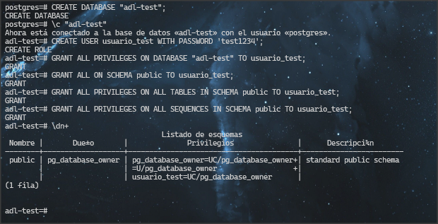
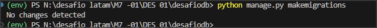
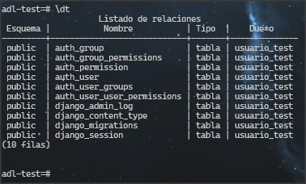
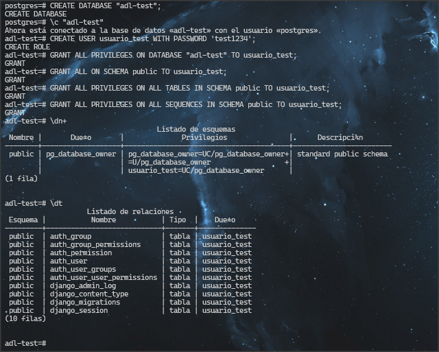

# Desafío Django y PostgreSQL Básico

Este es el repositorio del desafío guiado de Django y PostgreSQL básico.

# Base de datos creada, usuario creado, permisos concedidos.

# Makemigrations Ejecutado

# Migrate Ejecutado

# Listado de tablas

# Captura completa de consola PgSQL

##FIN